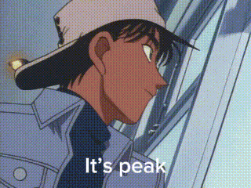

<pre lang="javascript">
                        (@@@@)          .            .                  .                          .              .                    .                        .                      .
  O        .           (   @@@@)             .      ___  .      .              .          .                .                    .                .                        .  
                      (     @@@@@)                (  \\)                             .              .                    .                  .               .                    .
                 _____/      @@@@@   .          (   \\\@)                .                                .                                                
    .           /           @@@@@            __(    \\\@@)                          .         .                 _¥_            .         .      .        (@@@)        .                  .
            (  \              @@@@@)        (......\\\@@@@)___                                       .        /| 0 |\                                (    @@@@@)
          (    /            @@@@@@)__           ^^^^^^^^^^^^^^^^            .            .               _^^^^^|_п_|^^^^_                    .  (       @@@@@@@@)
 .        ((            @@@@@@@@@@@@@))        .          .          .            .                ____//////////\\\\\\\\\____         ,,,,,(...............@@@@@@@)
     ____(            @@@@@@@@@@@@@@)                                     .                    ___///////////////\\\\\\\\\\\\\\___          
    (________\\\\\\\@@@@@@@@@@@@@@)         .                .                  .        .   /\_/\_/\_/\_/\_/\_/\_/\_/\_/\_/\_/\_/\                                                (@@)
                                         ______                      .                  ____|  _              ___      __    ___   |___                              _____________(  @@@)
      A                  A              /      \        .        .      .             /  _    /       __/    /   __  /      \    \  _   \                       ....(................@@@@)
    //|\\       A      //|\\         _/   .曇.   \_         .               .     ___/  /    |      _/          /     __    __      __    \___
    //|\\      / \     //|\\          |   ____   |                            __/  _  /       _      __    __/      /     ___  \      \      _\__
    //|\\      /_\     //|\\          |   |  |   |                          /     /      ___/     __/   __/        /     __     |__    \__        \
......|.........|........|............|___|..|___|......................../            /        /      | @susalulmumaO12   \        \      \        \...............................................
</pre>


<h3 align="center">
  Hello! This is Salma, Network Engineer 
  
</h3>

<p align="center">
  <a href="https://git.io/typing-svg"></a>
</p>


<br>


### 🛈 About Me (<a href="./assets/SalmaAlfawal-CV.pdf" target="_blank">View My CV</a>)
|🏢 I'm a **Backend Developer** Using **Nodejs** & **Express**.|
| :--- |
|🌱 I’m currently studying computer networking.
|🔭 Working on my NodeJs skills.|
 


> I am a Backend Developer using **Node.js**, **Express.js**, and **MySQL**, where I utilize my skills in **SQL**, **JavaScript**, and **Node.js** to design, develop, and maintain the backend of freelance applications. I am passionate about **learning new technologies** and frameworks like **Flutter** and **Laravel**, and I have completed several online courses and certifications in both **Backend Development** and **Frontend Development**.


<br>


### 🎯 &nbsp;My Skills
| 💻 **Languages & Frameworks** |
| :--- |
| |
| 🛠 **Tools** |
| |


<br>


## My Lifecycle


```js
function main() {
    while (true) {
        [code, painting, helpOthers, rest].
        forEach(task => task());
        console.log("Repeating the cycle...");
    }
}

const code = () => console.log("Writing code...");
const painting = () => console.log("Painting...");
const helpOthers = () => console.log("Helping others...");
const rest = () => console.log("Taking a break...");

main();
```


<br>


### 📩 Let's Talk:
<a href="https://discord.com/users/susalulmumao12" target="_blank"></a>
<a href="https://www.linkedin.com/in/salma-fawal12/" target="_blank"></a>
<a href="fawal.salma@gmail.com" target="_blank"></a>


<br>


## 🎖️ My Statistics:

<!-- GitHub Stats -->
<table align="center">
  <tr>
    <td align="center" style="padding: 10px;">
      <h3>📊 Top Languages:</h3>
      
    </td>
    <td align="center" style="padding: 10px;">
      <h3>🔥 GitHub Streaks:</h3>
      
      <br><br>
      
    </td>
  </tr>
</table>

<br><br>


<br>


### ✨ Random Quote:
<a href="https://github.com/piyushsuthar/github-readme-quotes">
    
</a>

